# Домашнее задание к занятию «Работа с данными (DDL/DML)» - савельев Алексей SYS-25

### Инструкция по выполнению домашнего задания

1. Сделайте fork [репозитория c шаблоном решения](https://github.com/netology-code/sys-pattern-homework) к себе в Github и переименуйте его по названию или номеру занятия, например, https://github.com/имя-вашего-репозитория/gitlab-hw или https://github.com/имя-вашего-репозитория/8-03-hw).
2. Выполните клонирование этого репозитория к себе на ПК с помощью команды `git clone`.
3. Выполните домашнее задание и заполните у себя локально этот файл README.md:
   - впишите вверху название занятия и ваши фамилию и имя;
   - в каждом задании добавьте решение в требуемом виде: текст/код/скриншоты/ссылка;
   - для корректного добавления скриншотов воспользуйтесь инструкцией [«Как вставить скриншот в шаблон с решением»](https://github.com/netology-code/sys-pattern-homework/blob/main/screen-instruction.md);
   - при оформлении используйте возможности языка разметки md. Коротко об этом можно посмотреть в [инструкции по MarkDown](https://github.com/netology-code/sys-pattern-homework/blob/main/md-instruction.md).
4. После завершения работы над домашним заданием сделайте коммит (`git commit -m "comment"`) и отправьте его на Github (`git push origin`).
5. Для проверки домашнего задания преподавателем в личном кабинете прикрепите и отправьте ссылку на решение в виде md-файла в вашем Github.
6. Любые вопросы задавайте в чате учебной группы и/или в разделе «Вопросы по заданию» в личном кабинете.

Желаем успехов в выполнении домашнего задания.

---

Задание можно выполнить как в любом IDE, так и в командной строке.

### Задание 1
1.1. Поднимите чистый инстанс MySQL версии 8.0+. Можно использовать локальный сервер или контейнер Docker.
---

### Ответ 1.1 

- Установил MySQL опираясь на [данную статью](https://losst.pro/ustanovka-mysql-ubuntu-16-04)

1.2. Создайте учётную запись sys_temp. 
---

### Ответ 1.2

- Я пользовался IDE DBeaver и пользователя создал через боковое меню.
[Ссылочка как установить DBeaver на Ubuntu 22.04](https://losst.pro/ustanovka-dbeaver-v-ubuntu-22-04)

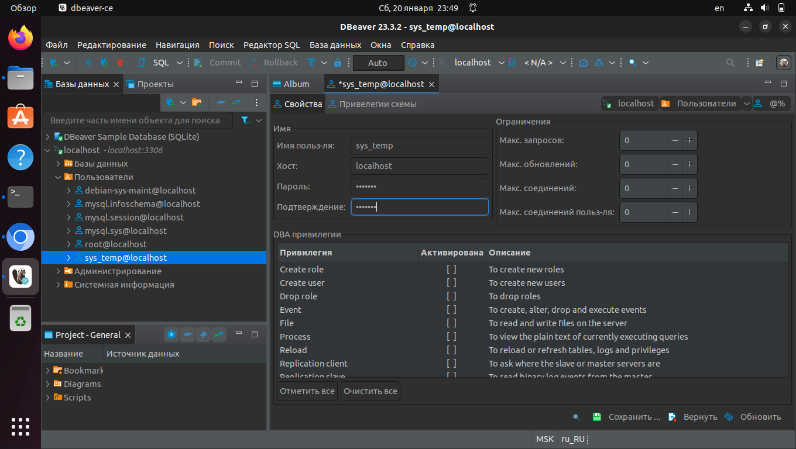
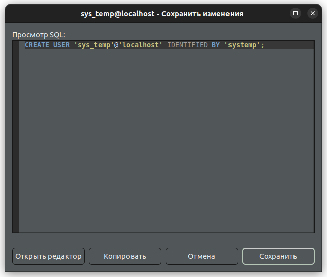
---

1.3. Выполните запрос на получение списка пользователей в базе данных. (скриншот)
---

### Ответ 1.3
---
- после входа в окружение MySQL 
```bash 
mysql -u root -p
```
выполнил следующую команду:     
```bash 
mysgl> SELECT user FROM user;
```
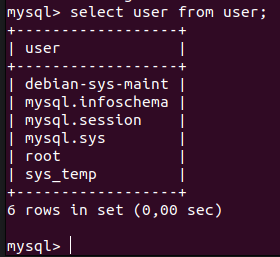
---

1.4. Дайте все права для пользователя sys_temp. 
---

### Ответ 1.4
- Выдал все права пользователю:
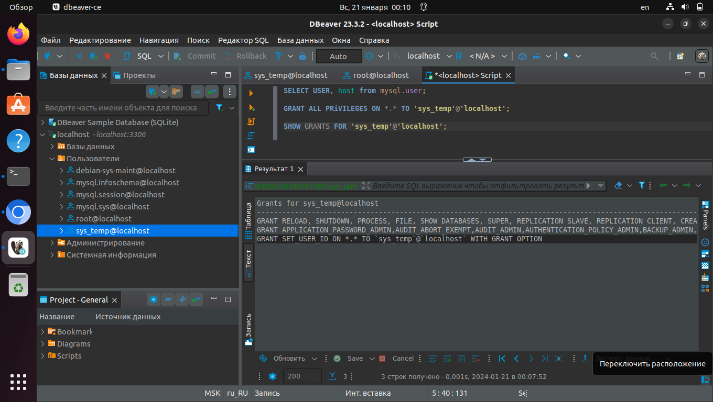
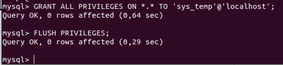
---

1.5. Выполните запрос на получение списка прав для пользователя sys_temp. (скриншот)
---

### Ответ 1.5

- Выполнил ткую команду:
```bash
mysql> SHOW GRANTS FOR 'sys_temp'@'localhost';
```
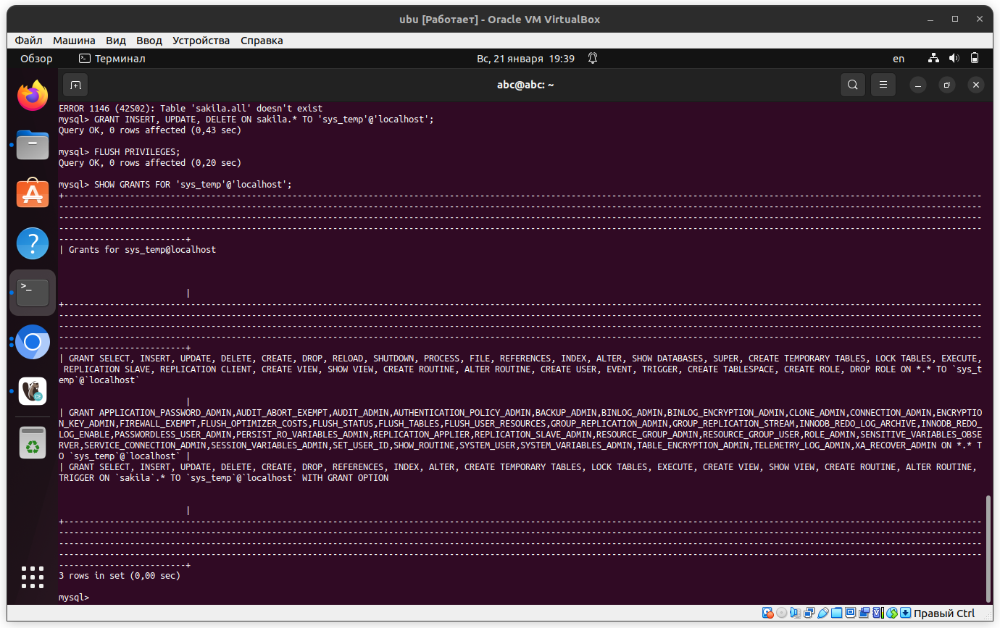

1.6. Переподключитесь к базе данных от имени sys_temp.

Для смены типа аутентификации с sha2 используйте запрос: 
```sql
ALTER USER 'sys_test'@'localhost' IDENTIFIED WITH mysql_native_password BY 'password';
```
1.7. По ссылке https://downloads.mysql.com/docs/sakila-db.zip скачайте дамп базы данных.

1.8. Восстановите дамп в базу данных.
---

### Ответ 1.8

- Выполнил следующие команды:
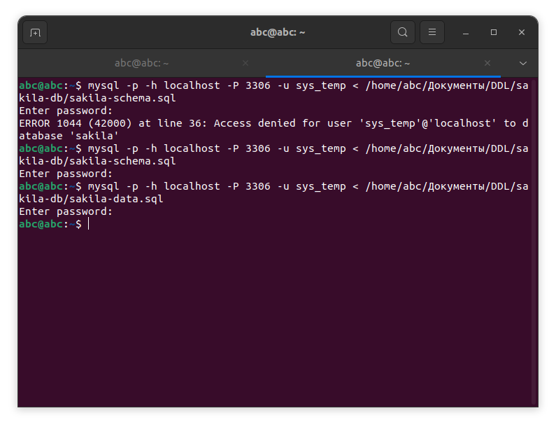
---

1.9. При работе в IDE сформируйте ER-диаграмму получившейся базы данных. При работе в командной строке используйте команду для получения всех таблиц базы данных. (скриншот)

*Результатом работы должны быть скриншоты обозначенных заданий, а также простыня со всеми запросами.*
### Ответ 1.9
---
- Я использовал возможности DBeaver:
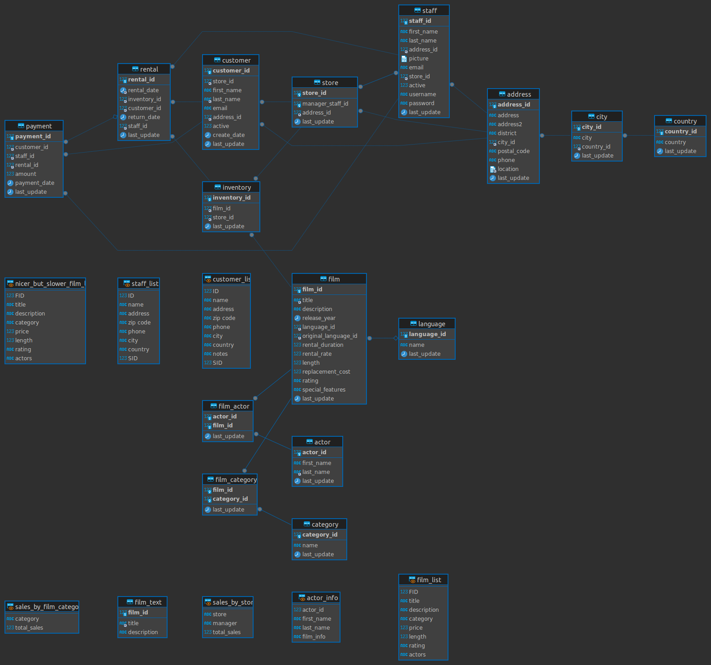
---
- но можно и из консоли:
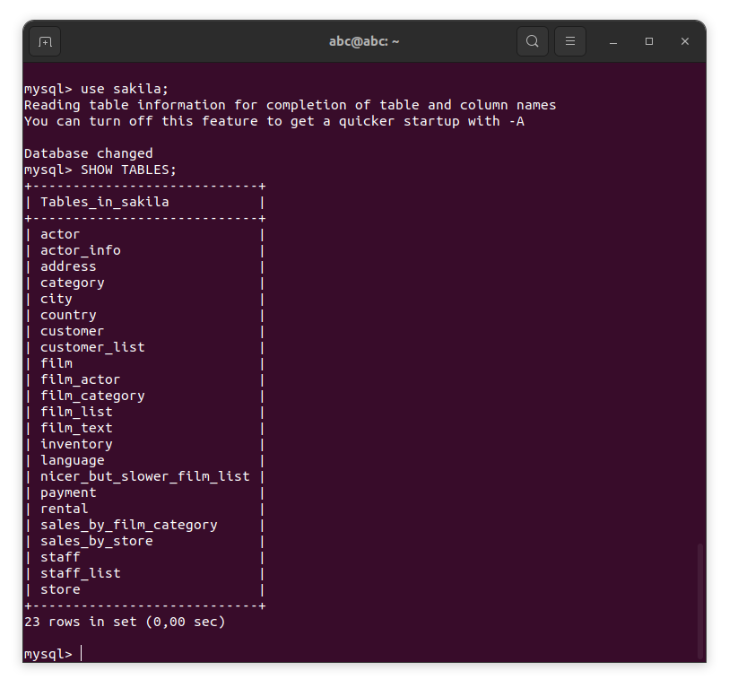
---

### Задание 2
Составьте таблицу, используя любой текстовый редактор или Excel, в которой должно быть два столбца: в первом должны быть названия таблиц восстановленной базы, во втором названия первичных ключей этих таблиц. Пример: (скриншот/текст)
```
Название таблицы | Название первичного ключа
customer         | customer_id
```

---

### Ответ 2

- Cоздавал в Google - документах:

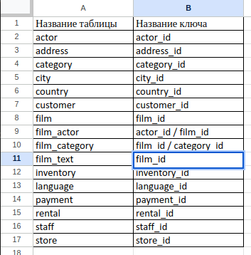
---

## Дополнительные задания (со звёздочкой*)
Эти задания дополнительные, то есть не обязательные к выполнению, и никак не повлияют на получение вами зачёта по этому домашнему заданию. Вы можете их выполнить, если хотите глубже шире разобраться в материале.

### Задание 3*
3.1. Уберите у пользователя sys_temp права на внесение, изменение и удаление данных из базы sakila.
---

### Ответ 3.1

- Выполнил такую команду для отмены привелегий:
```bash
mysql> REVOKE INSERT, UPDATE, DELETE ON sakila.* FROM 'sys_temp'@'localhost'
```
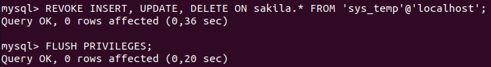

- или в приложении:
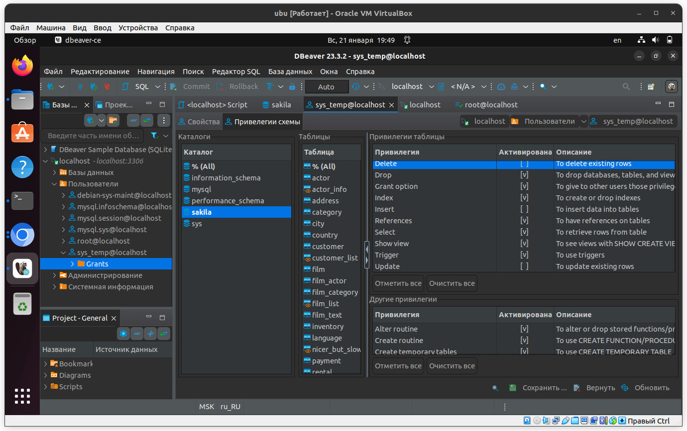
---

3.2. Выполните запрос на получение списка прав для пользователя sys_temp. (скриншот)

*Результатом работы должны быть скриншоты обозначенных заданий, а также простыня со всеми запросами.*
---

### Ответ 3.2
- Выполнил на получение списка прав для пользователя:
```bash
mysql> SHOW GRANTS FOR 'sys_temp'@'localhost'
```
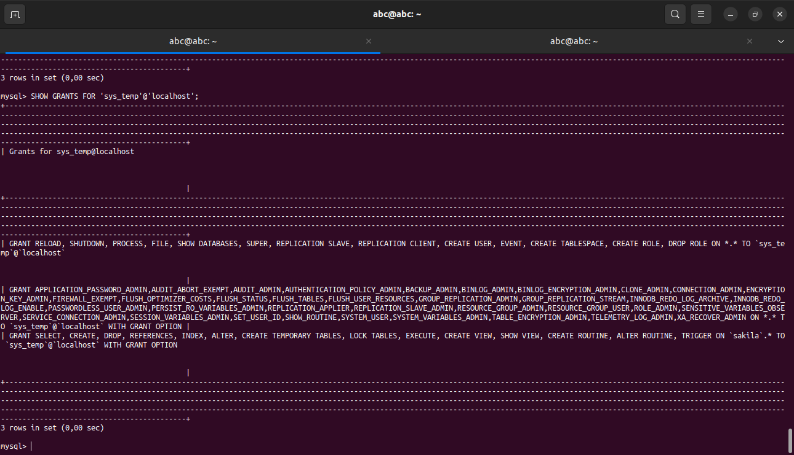
---
s